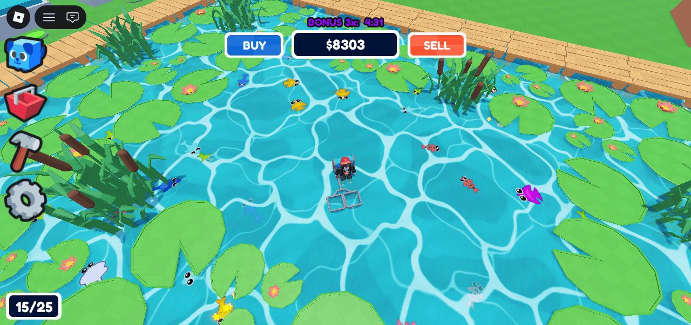
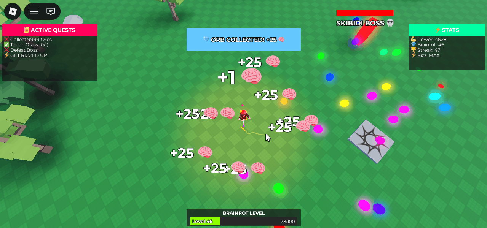
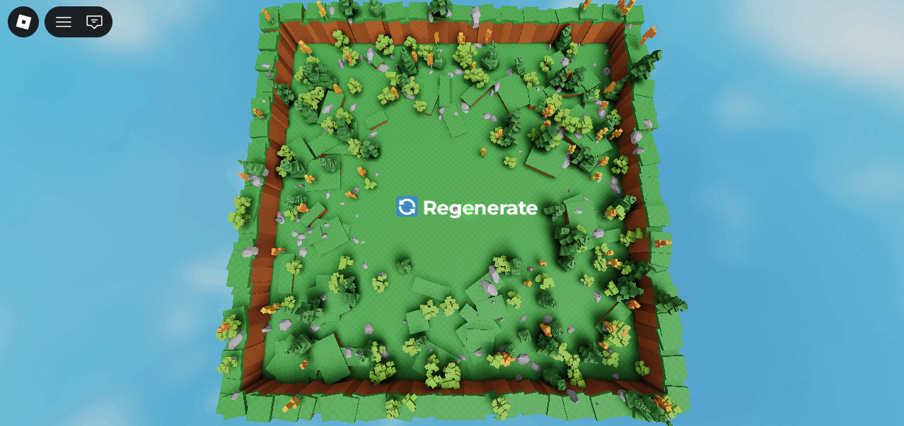
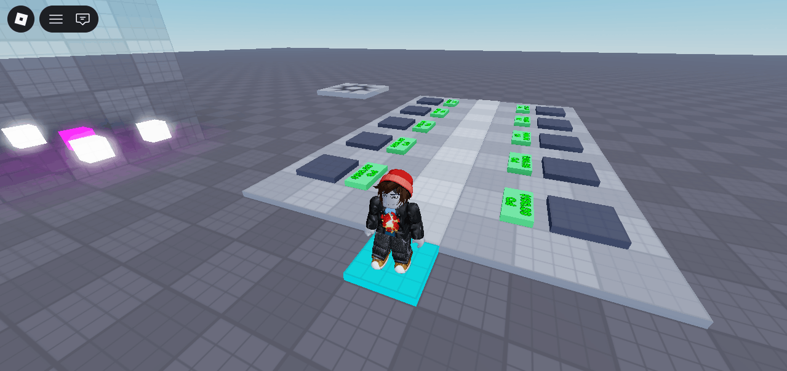

# 🎮 Developer Portfolio

> *Building fun, polished Roblox experiences — one game at a time.*

---

## 👋 About Me

Hey, I'm Alfrenzo! A developer who loves building Roblox games and bringing creative ideas to life through Lua. I focus on crafting fun, polished experiences that keep players coming back for more.

Whether it's a laid-back tycoon, a fast-paced adventure, or something totally out of the box — if it's fun, I'm building it.

---

## 🕹️ Projects

<table>
  <tr>
    <td align="center" width="50%">
      <a href="https://github.com/Alfrenzo/FishPondTycoon">
        
         
        <h3>🐟 Fish Pond Tycoon</h3>
      </a>
    </td>
    <td align="center" width="50%">
      <a href="https://github.com/Alfrenzo/DopamineRetox">
        
         
        <h3>🧠 Dopamine Retox</h3>
      </a>
    </td>
  </tr>
  <tr>
    <td align="center" width="50%">
      <a href="https://github.com/Alfrenzo/TerrainGenerator">
        
         
        <h3>🌳 Terrain Generator</h3>
      </a>
    </td>
    <td align="center" width="50%">
      <a href="https://github.com/Alfrenzo/StealABrainrot">
        
         
        <h3>😵 Steal A Brainrot (Template)</h3>
      </a>
    </td>
  </tr>
</table>

---

## 🛠️ Built With

- **Roblox Studio**
- **Lua** — all game logic and UI scripting
- A genuine love for fun, satisfying player experiences

---

## 📬 Contact

Got a collab idea, want to chat, or just wanna say hey?

> 💬 **Discord:** `alfrenzo1`

---

*✨ Thanks for stopping by — go touch grass, then come back and play my games.*
